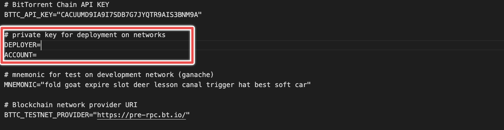
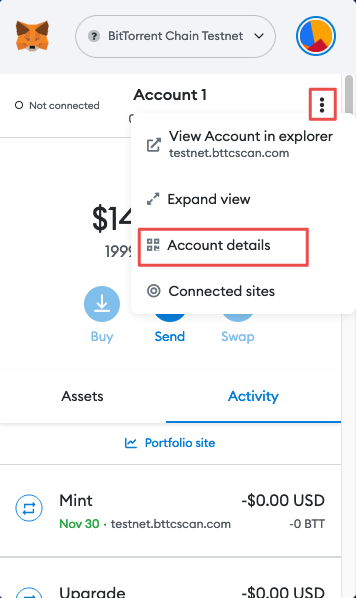
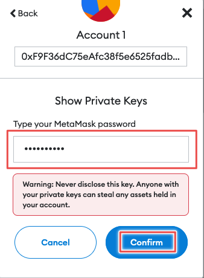
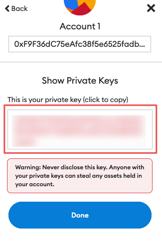

<h3 id="readme_start">Prerequisites</h3>

- Require Metamask wallet, and two accounts with available balances. Follow <a href="./markdown/funding.md#install_metamask">this</a> to create and fund your accounts
- Once you complete creating Metamask wallet and funding your accounts, it requires to create an environement file
    - Create the `.env` file
    - Find `env.example`, then open and copy all content in this file
    - Paste copied content into `.env` file
    - Next, you need private keys of two funded accounts to be pasted into `.env` file
    <p align="center">
         
    </p>

    - Open your Metamask wallet -> click on three dots -> choose `Account details`
    <p align="center">
         
    </p>

    - Choose `Export private keys`, then you will be prompted to type your Metamask wallet password
    <p align="center">
         
    </p>

    - Type your password and click on `Confirm` button
    - Copy your private key to either `DEPLOYER` or `ACCOUNT` in the `.env` file
    <p align="center">
         
    </p>
    - Repeat these step for the last private key

**WARNING**: 
- DO NOT share private keys to anyone even these accounts only use for testing purpose
- DO NOT use your main accounts
- Recommend to create brand new accounts in this experiment 

<h3 id="installation">Installation</h3>

- Install dependencies by running this command:

```bash
yarn
```

- Compile smart contracts

```bash
yarn compile
```

Now, it's all set and ready to run an experiment

### Try it with Morpheus Labs SEED<br/>[](https://bps.morpheuslabs.io/pages/uploadproject/?f=factorycmbkd9ozkhj7tnby&p=https%3A%2F%2Fgithub.com%2FMorpheuslabs-io%2FLoyalty-workshop.git&installNode=true)

<p align="center">
    <a href="./markdown/experiment.md#experiment_start">Let's move on</a>
</p>
