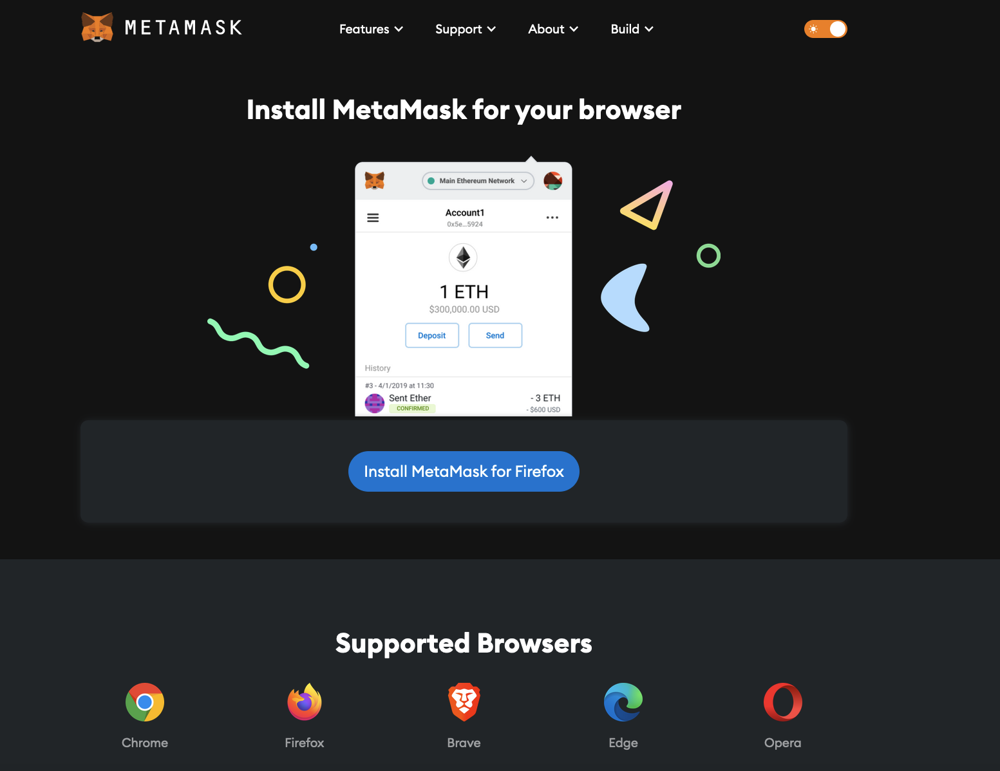
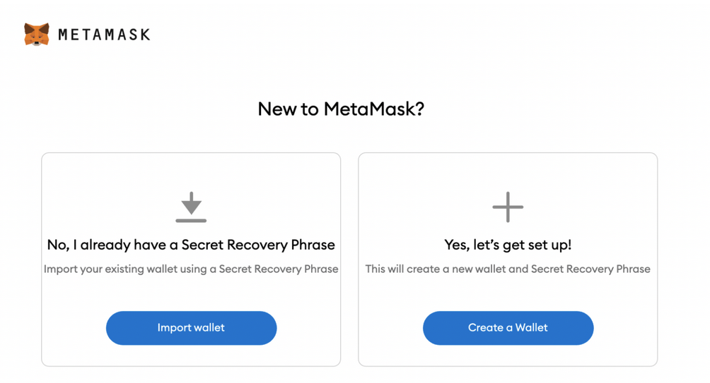
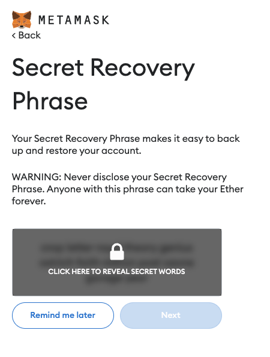
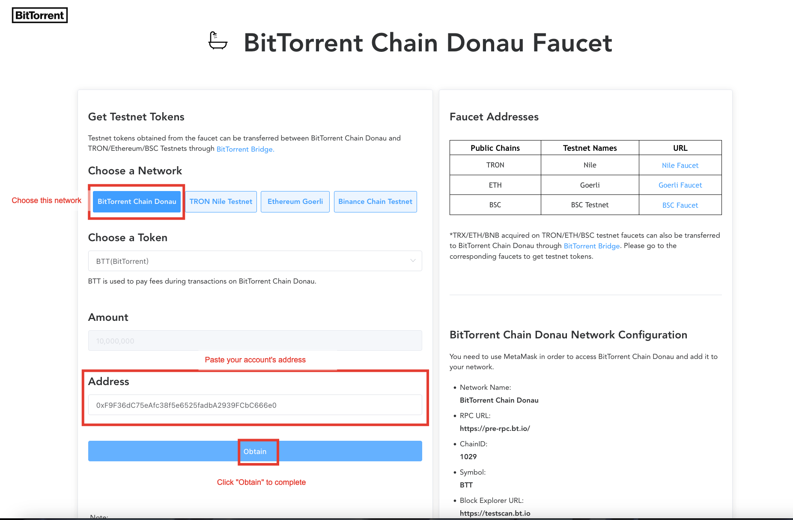
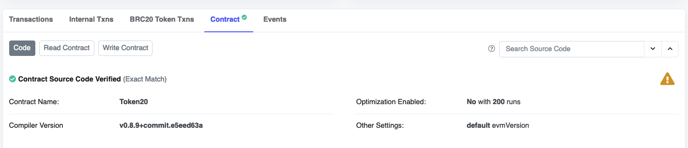
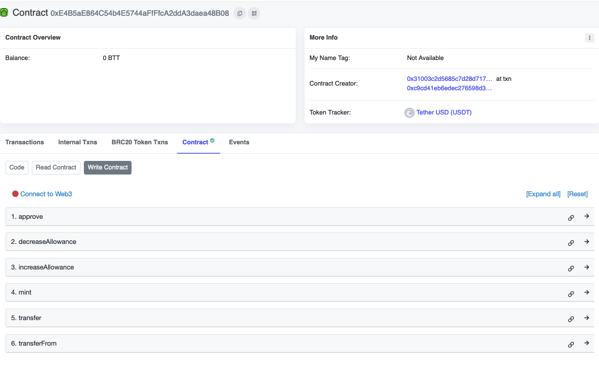
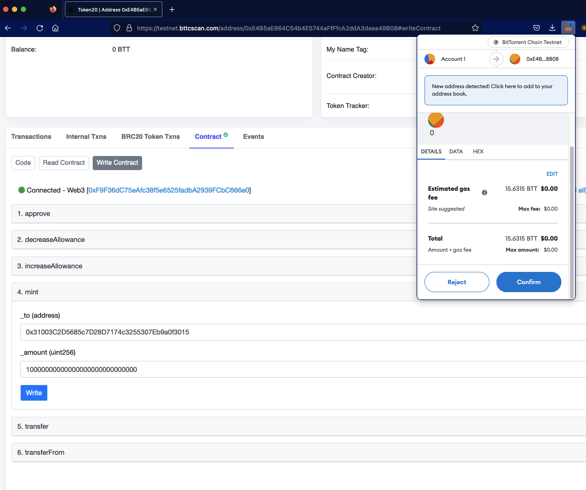

<h3 id="install_metamask">Install Metamask and Create a wallet</h3>

**Note**: If you already have Metamask wallet installed, please skip and move to <a href="#funding_account">Funding your account with BTTC</a>

- Download [Metamask](https://metamask.io/download/) for your web browser (Chrome, Firefox, Brave, and Edge)

     

- Navigate in the top right corner and find Metamask icon extension
- Click `Get Started` button and you will be taken to the next page with two options as following

     

- Choose `Import Wallet` if you already have Metamask wallet on a different device
- Otherwise, please choose `Create a Wallet` to set-up a brand new Metamask wallet
- Follow these steps if you choose `Create a Wallet`
- Set up your password -> Click `Create` button -> Click `Next`
- Click on `CLICK HERE TO REVEAL SECRET WORDS`

     

- Copy and save these words if you want to `Import Wallet` on another device. Please DO NOT share these words to anyone
- You will be prompted to type in the secret phrase as provided before finishing to create the Metamask wallet

<h3 id="funding_account">Funding your accounts with BTTC</h3>

Smart contract deployments and transactions on BitTorrent Chain Testnet require BTTC tokens to pay gas fee. Please follow these instructions to fund your accounts:

- Go to this website [https://testfaucet.bt.io/#/](https://testfaucet.bt.io/#/)
- Choose `BitTorrent Chain Donau`
- Open Metamask and copy one Account's address
- Paste to `Address`
- Click `Obtain` to complete
- Repeat these steps and fund the second account

<h3>Funding your accounts with mocking erc-20 tokens</h3>

In this experiment, you will be using ERC-20 Token as a payment to `buy` loyalty points, and to `topup` gift card's value. Please follow below instructions to mint tokens for your accounts:

- If you don't have Metamask installed for your web browser, please check <a href="#install_metamask">Install Metamask</a> 
- Click on this [link](https://testnet.bttcscan.com/address/0xE4B5aE864C54b4E5744aFfFfcA2ddA3daea48B08#code) to mint tokens

- Click on `Write Contract` button, then you will be taken to the next page

- Click on `Connect to Web3` to connect your Metamask wallet
- Once connected, choose `4. mint`
- Copy and paste any account's address that you want to mint tokens to `_to (address)`
- Copy and paste this amount `10000000000000000000000000000` to `_amount (uint256)`
- Click on `Write` and you will be prompted to sign a transaction

- Click on `Confirm` to sign and send a transaction to bittorrent chain testnet
- Please repeat minting steps for another accounts
